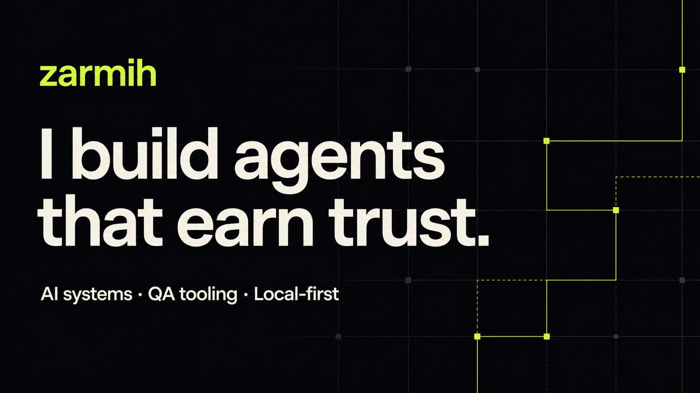

# Reliable AI systems. Evidence-based QA.

I build local-first agents, QA automation, and developer tools designed to stay inspectable when the work gets consequential. My projects combine bounded autonomy with deterministic execution, explicit approvals, reproducible evidence, and honest evaluation.

[Explore my repositories](https://github.com/zarmih?tab=repositories) · [Follow the work](https://github.com/zarmih)

## Selected work

- **[Agentic QA](https://github.com/zarmih/agentic-qa)** — a TypeScript CLI that explores web applications, proposes grounded QA plans, verifies failures, and generates reviewable Playwright regressions. LLMs plan; deterministic code executes.
- **[RuDataAnalyst SQL](https://github.com/zarmih/RuDataAnalyst-SQL)** — a local Russian text-to-SQL system built with Qwen3, QLoRA, FastAPI, SQLite guardrails, and a blind benchmark on unseen schemas.
- **[ByeByeDPI Linux](https://github.com/zarmih/ByeByeDPI-Linux)** — an unofficial PySide6 desktop client for local SOCKS5 workflows on Linux, with GNOME/KDE integration, automated tests, and release tooling.
- **[UniversalAgent](https://github.com/zarmih/UniversalAgent)** — an experimental local task orchestrator built around approvals, evidence, durable state, and isolated workers.

## How I build

- Bound agent capabilities before adding autonomy.
- Keep artifacts, traces, and tests so decisions remain reviewable.
- Prefer local-first architecture and explicit data boundaries.
- Publish limitations and measured results, not just happy-path demos.

## Core toolkit

`TypeScript` · `Python` · `Playwright` · `FastAPI` · `SQLite` · `LangGraph` · `QLoRA` · `GitHub Actions`

---

Most of my current work sits at the intersection of AI agents, QA automation, and reliable developer infrastructure.
